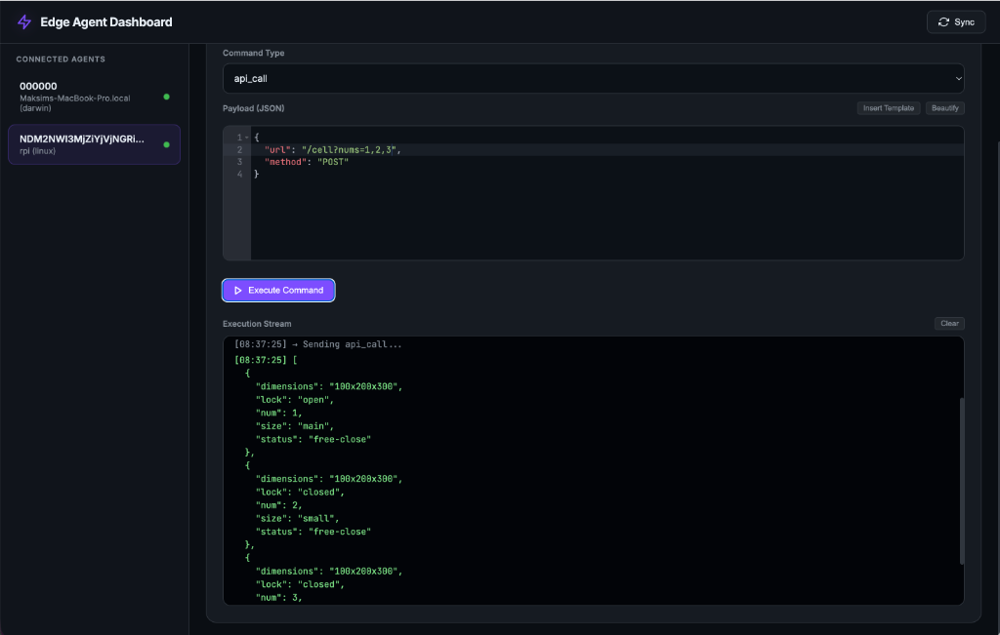
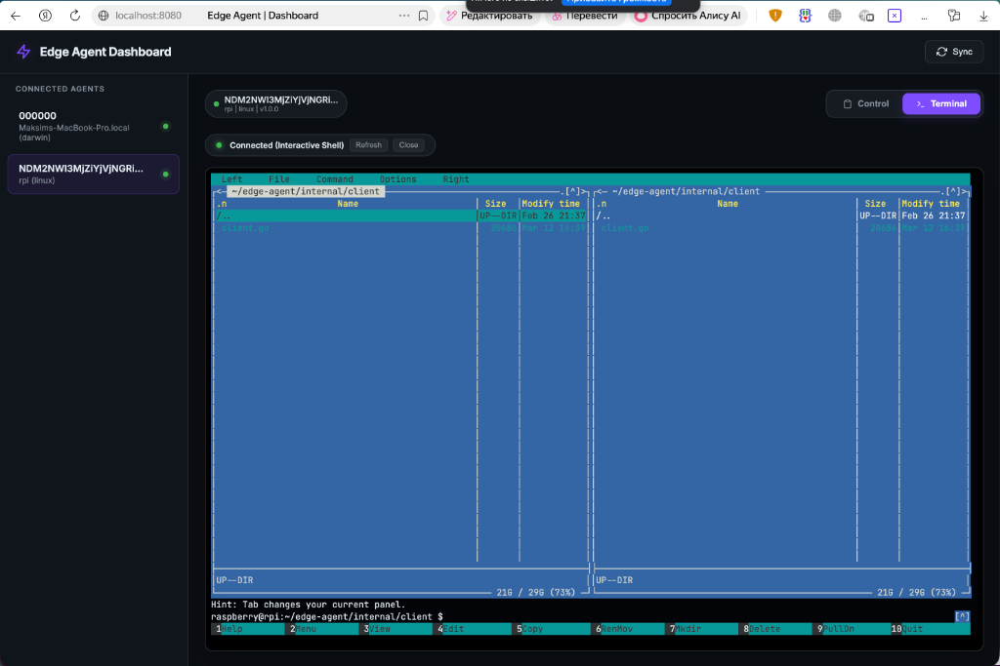
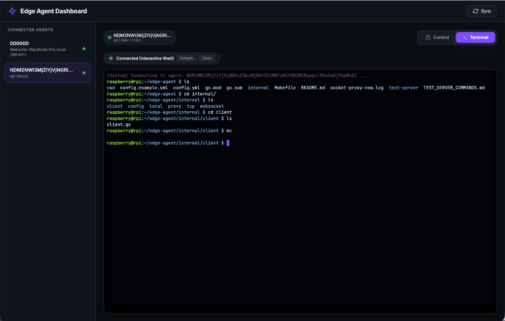
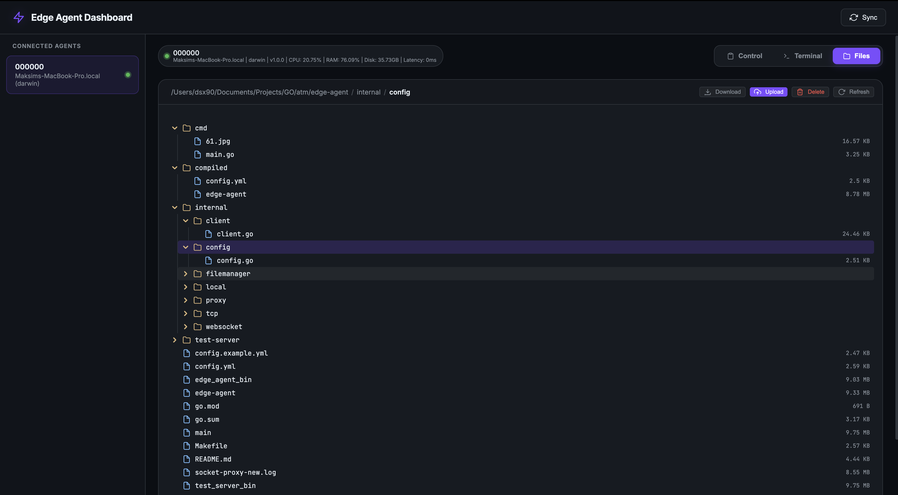

# Edge Agent Test Server

Инструмент для тестирования и отладки Edge-агентов. Позволяет имитировать поведение сервера, управлять агентами через веб-интерфейс и проксировать SSH-сессии.

## Основные возможности

- **Управление агентами**: Поддержка подключений через Raw TCP и WebSocket.
- **SSH Proxy**: Проксирование терминала из браузера в локальный SSH-сервер.
- **Интерактивный терминал**: Доступ к PTY агента напрямую из веб-интерфейса.
- **Файловый менеджер**: Полноценное управление файлами (просмотр, загрузка, скачивание, удаление) с предпросмотром изображений и текста.
- **REST API**: Эндпоинты для получения списка агентов, доступных команд и отправки запросов.
- **Predefined Commands**: Возможность настройки шаблонов команд в конфигурационном файле.

## Структура проекта

- `main.go` — Основной код сервера (TCP/WS, SSH, Web).
- `config.yml` — Конфигурация портов и шаблонов команд.
- `index.html` — Веб-интерфейс (Dashboard).
- `assets/` — Скриншоты и графические материалы.

## Конфигурация (`config.yml`)

В файле конфигурации можно настроить порты для различных сервисов и задать шаблоны команд:

```yaml
server:
  agent_port: ":8081" # Порт для подключения агентов (WS + TCP на :8082)
  ssh_port:   ":2222" # Порт встроенного SSH сервера
  web_port:   ":8080" # Порт веб-интерфейса
```

## Как запустить

```bash
go run test-server/main.go --config test-server/config.yml
```

## Скриншоты

### Веб-панель управления (API Call)


### Интерактивный терминал (Midnight Commander)


### Сессия в терминале


### Файловый менеджер


### Предпросмотр файлов

